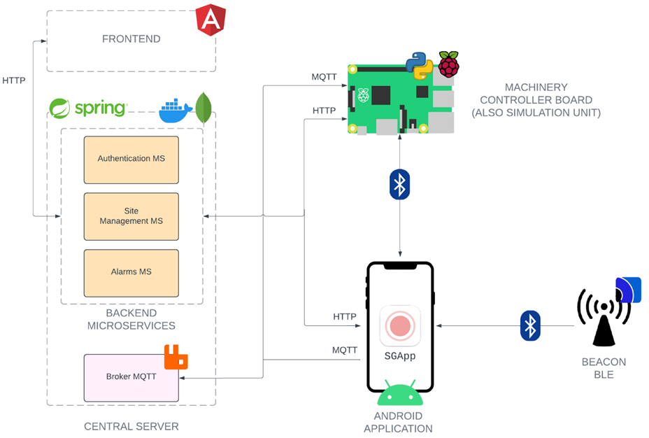

# GROUND WORKERS LOCATION AND IDENTIFICATION SYSTEM

This project aims to develop a Proximity Warning System (PWS) using Bluetooth Low energy (BLE) technology in work contexts where mobile machinery and workers on the ground are present.\
\
The system can detect proximity situations between these subjects in real-time, notifying those concerned in case of danger. Additionally, it supports other types of alarms, including general communications and signaling when drivers are away from machinery.\
\
Furthermore, the system offers functionalities for the management of site resources, allows the definition of a daily configuration of active machines with their authorised drivers, and guarantees secure access to the proximity notifications. Thanks to the software and hardware solutions adopted, it is easily extendable and adaptable to specific needs. 
## Architecture
The system architecture is outlined below:

The developed components are:
* the central server\
https://github.com/UniSalento-IDALab-IoTCourse-2022-2023/wot-project-2022-2023-central_server-accogli_carluccio.git
* the machinery controller board\
https://github.com/UniSalento-IDALab-IoTCourse-2022-2023/wot-project-2022-2023-controller_board-accogli_carluccio.git
* 🟡(this repo) <b>android application </b> 
* frontend application\
https://github.com/UniSalento-IDALab-IoTCourse-2022-2023/wot-project-2022-2023-app_angular-accogli_carluccio.git

## THIS REPO: Android application
This app is the active part of the proximity system. It presents different interfaces based on the operator's role:
* A mode for <b>GROUND OPERATORS</b> implements functionalities for scanning surrounding beacons, calculating their respective distances, and potentially generating alarms
* A part for <b> DRIVER OPERATORS </b> implements an interface for connecting with the machinery controller unit, a dashboard for relevant communications, and offers functionalities for calculating the distance from the control unit.

## Usage
Install the SSGApp using Android Studio
